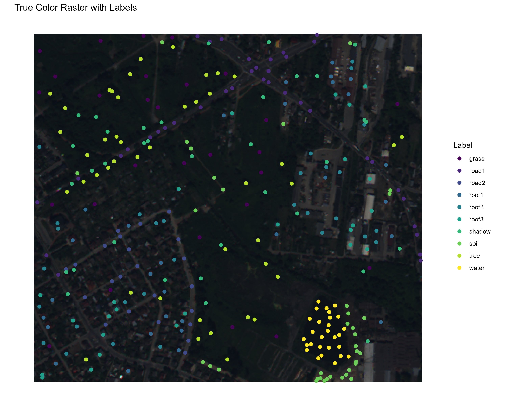
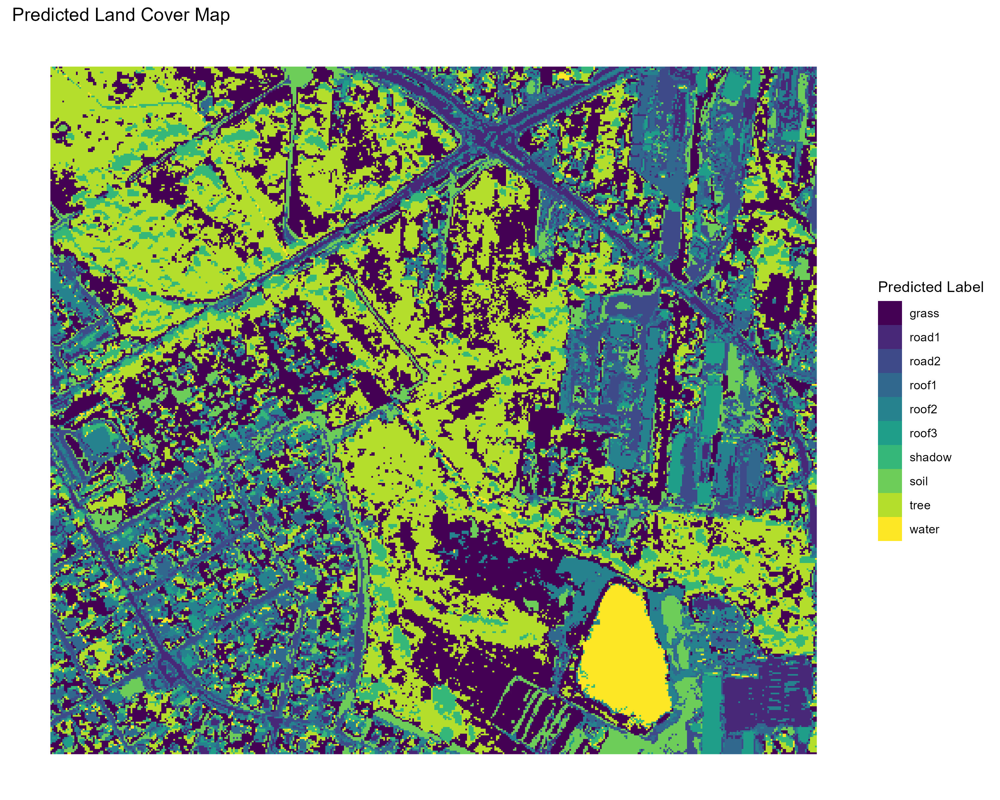
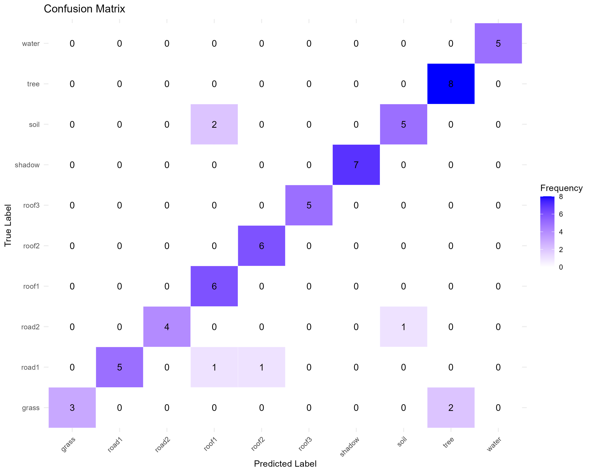

# Land Cover Classification Using Random Forest

## Overview

In this analysis, a **Random Forest classification model** was employed to predict land cover types from satellite image data. The semantic classes include `grass`, `road`, `roof`, `shadow`, `soil`, `tree`, and `water`, with `road` and `roof` having multiple instances. The dataset was split into training (80%) and validation (20%) subsets using **stratified sampling** to ensure class balance.

## Dataset Split

The class distribution in the training and validation datasets is shown below:

### Table 1. Class Distribution in Training and Validation Datasets

| Class      | Train | Validation |
|------------|-------|------------|
| grass      | 23    | 5          |
| road1      | 31    | 7          |
| road2      | 20    | 5          |
| roof1      | 24    | 6          |
| roof2      | 24    | 6          |
| roof3      | 20    | 5          |
| shadow     | 28    | 7          |
| soil       | 29    | 7          |
| tree       | 36    | 8          |
| water      | 23    | 5          |

## Model and Evaluation

### Model Description

The Random Forest model was trained on the training set using the following parameters:

- `ntree = 100` (number of trees)
- `importance = TRUE` (calculates feature importance)
- `keep.forest = TRUE` (retains the trained forest for predictions)

The training set was used to build the model, while the validation set was used for performance assessment. The predictor variables consisted of eight bandwidth measurements per sample (band1 to band8).

### Model Accuracy

The model's accuracy was evaluated using a **confusion matrix** and metrics such as **precision**, **recall**, and **balanced accuracy**.

#### Table 2. Validation Metrics

| Class   | Precision ↑ | Recall ↑ | Accuracy (balanced) ↑ |
|---------|-------------|----------|-----------------------|
| grass   | 1.00        | 0.60     | 0.80                  |
| road1   | 1.00        | 0.71     | 0.86                  |
| road2   | 1.00        | 0.80     | 0.90                  |
| roof1   | 0.67        | 1.00     | 0.97                  |
| roof2   | 0.86        | 1.00     | 0.99                  |
| roof3   | 1.00        | 1.00     | 1.00                  |
| shadow  | 1.00        | 1.00     | 1.00                  |
| soil    | 0.83        | 0.71     | 0.84                  |
| tree    | 0.80        | 1.00     | 0.98                  |
| water   | 1.00        | 1.00     | 1.00                  |

(* ↑ indicates that higher values represent better performance.)

### Validation Accuracy

The overall validation accuracy of the Random Forest model was **0.89**.

## Visualizations

### Figure 1. Confusion Matrix of Validation Set Predictions

### Figure 2. True Color Raster with Ground Truths Overlay

### Figure 3. Predicted Land Coverage

These figures illustrate the model's performance, with the true color image showing the ground truth labels, and the predicted land cover map visualizing the model's predictions for the entire satellite image.
